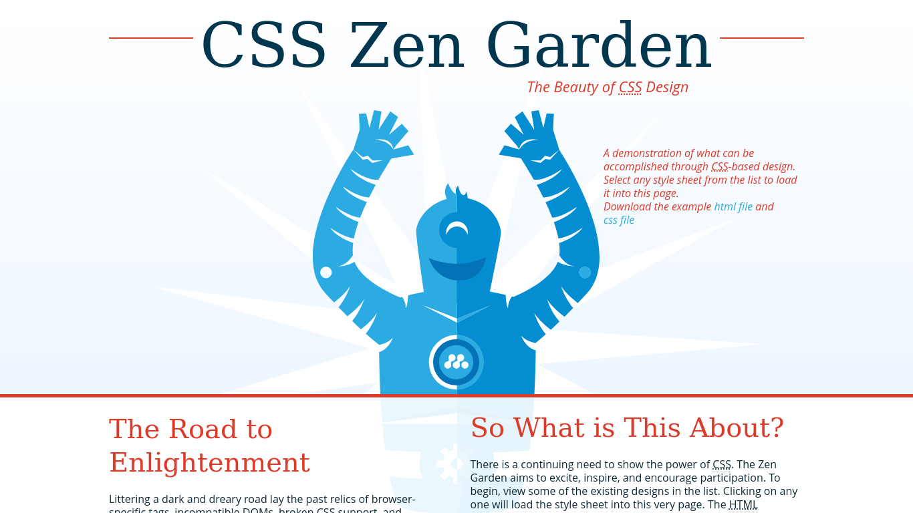

# Zen Garden

## Description 
This repo is from the CSS Zen Gardens activity for EdX Bootcamp. The task was as follows:

  * Create a new public GitHub repository, and name it `zen-garden`. Be sure to check the box for “initialize this repository with a README.”
  * Clone the repo to your local directory.
  * Go to [CSS Zen Garden](http://www.csszengarden.com/). Navigate to a few of the examples and choose a page that you like.
  * Download the HTML and CSS. Each page has a link to download the code, normally near the top of the page.
  * Move the HTML and CSS into your newly cloned repo and open the HTML in Chrome. 
  * Use inspect element to identify a page element you would like to change in some way.
  * Change the CSS in any way you'd like.
  * Add, commit, and push the code to GitHub.

## Installation

The site does not require installation steps.

## Usage 

The website can be viewed at [https://bowseruk.github.io/zen-garden/](https://bowseruk.github.io/zen-garden/) with Google Chrome. The source can be viewed in Chrome by right clicking and selecting inspect.

## Credits

This site was based on a activity by edX Boot Camps LLC.

[W3School](https://www.w3schools.com/) was used as a reference for elements to use and good practice.